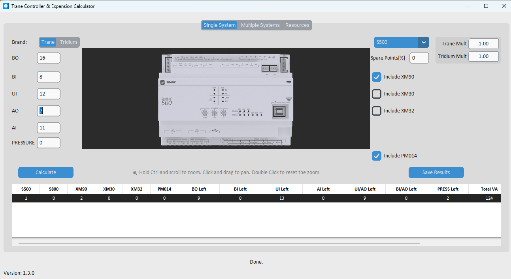

<div align="center">

# Trane Controller and Expansion Calculator

Desktop sizing and pricing tool for Trane and Tridium controller layouts, built for quick engineering checks, cleaner exports, and faster budgeting decisions.


</div>

> Built for the real work: point balancing, controller selection, expansion mix comparison, width and VA review, and export-ready pricing output.

## At a Glance

| What it helps with | What you get |
| --- | --- |
| Single-system sizing | Optimized controller and expansion combinations |
| Multi-system takeoffs | Batch import and consolidated output tables |
| Budget protection | Public list prices with private runtime multipliers |
| Submittal prep | Excel/CSV export plus quick datasheet access |

## Visuals



<p align="center"><sub>Concept preview for the desktop workflow: point entry, brand multipliers, and optimized result combinations.</sub></p>

## Download

Get the latest Windows build:

https://github.com/felipeacevedo1014/controller_calculator/releases/latest

- Executable: **points_calculator.exe**
- Install: none required, run directly
- Updates: automatic check at app launch

## Why This App

Designing point-dense control systems usually means juggling:

- Point capacity limits
- Mixed expansion strategies
- I/O constraints
- Price and panel width tradeoffs

This app compresses that work into a focused desktop workflow so you can move from point counts to viable hardware combinations quickly, without manually building comparison sheets every time.

## Core Features

### Calculation and selection

- Single System tab for one-off controller sizing
- Multiple Systems tab for batch processing from Excel/CSV
- Brand-aware calculations for Trane and Tridium combinations
- PM014 support in optimization path
- Width and total VA included in results

### Workflow and output

- Runtime pricing multipliers by brand
- Datasheet quick links from within the UI
- Add/Delete row controls for batch input workflow
- Downloadable batch-input template
- Export results to Excel or CSV

## Pricing Model

Pricing is intentionally split into two stages for safer public source control:

1. Repository prices are stored as **list prices**.
2. Final prices are computed in the app at runtime.

Formula used by the UI and exports:

- Trane final price = list price x Trane multiplier
- Tridium final price = list price x Tridium multiplier

Defaults:

- Trane multiplier: `1.00`
- Tridium multiplier: `1.00`

Both multipliers are configurable in:

- Single System
- Multiple Systems

This keeps the repository safe to publish while still allowing real-world quoted pricing inside the app.

## Active Product Catalog

Current active products in the pricing catalog:

- S500
- S800
- XM90
- XM30
- XM32
- PM014
- JACE9000
- JACE9005
- JACE9010
- JACE9025
- JACE9100
- JACE9200
- IO-R-16
- IO-R-34

Obsolete products (removed from active app paths):

- XM70
- UC600

## Typical Workflow

### Single System

1. Enter the required point counts.
2. Choose the controller family you want to evaluate.
3. Set Trane and Tridium multipliers.
4. Run the calculation.
5. Review optimized combinations, remaining points, VA, width, and price.

### Multiple Systems

1. Download the template.
2. Fill in systems in Excel or CSV.
3. Import the file into the app.
4. Set brand multipliers.
5. Run the batch calculation.
6. Export the consolidated results.

## Run From Source

### Requirements

- Windows environment
- Python 3.x
- Dependencies in `requirements.txt`

### Setup

```powershell
python -m venv .venv
.\.venv\Scripts\Activate.ps1
pip install -r requirements.txt
```

### Launch

```powershell
python gui.py
```

## Tech Stack

- Python
- CustomTkinter and Tkinter
- pandas
- Pillow
- requests
- openpyxl

## Build Standalone EXE (PyInstaller)

```powershell
pip install -U pyinstaller packaging requests certifi
pyinstaller --noconfirm --onefile --name controller_calculator gui.py
```

The app also performs a GitHub release check at startup so distributed builds can point users to the latest release when a newer version is available.

## Project Structure

- `gui.py` - main desktop UI and workflow orchestration
- `core.py` - calculation engine and pricing fallback logic
- `prices.csv` - list-price catalog used for live pricing load
- `updater.py` - GitHub release version check
- `tooltip.py` - UI helper utilities
- `version.py` - app name and semantic version

## Roadmap

Planned/desired improvements:

- Better screen-resolution-aware image scaling
- Total VA requirement improvements

## Notes for This Fork

- Active repository pricing is stored as list price values.
- Runtime multipliers are applied separately for Trane and Tridium.
- Current active catalog excludes obsolete XM70 and UC600 paths from the live app.

## License

MIT License. See `LICENSE`.
